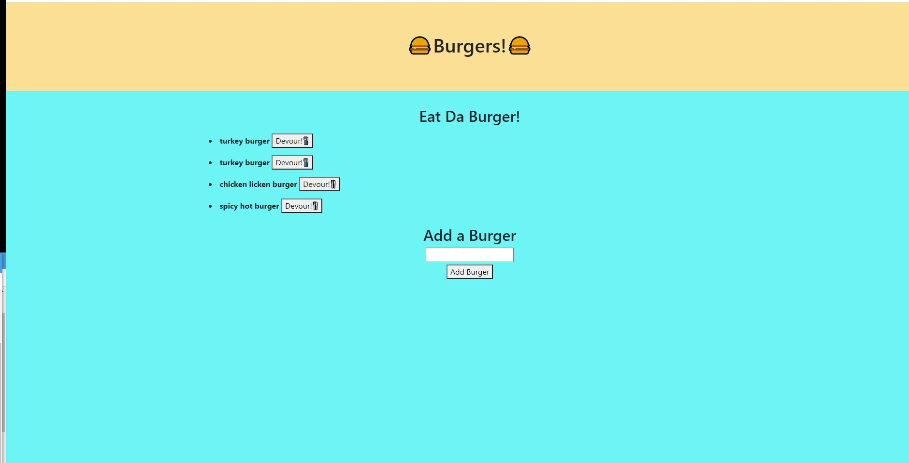

# Burger Eating Application

## Functionality

- When you open the page, you will see a set of seeded burgers with a "devour" button next to them on the left side of the page.
- You also find the add burger form and button at the bottom of the body section.
- You can add the new burger, which will apppear on the left side with the "devour" button.
- When you press the "devour" button, you will see the burger move to the right side of the page with a new button "vomit"
- When you press the "vomit" button, you will see the burger be moved back to the left side of the screen with the "devour" button in place. Gross, but pretty entertaining. 😝🤢

## Site Image

